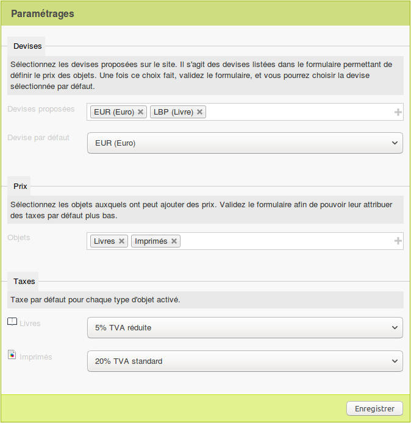
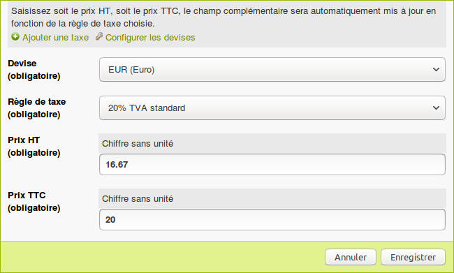

# Plugin bigaille 

> Ce plugin est une expérimùentation dépréciée !
> Utilisez le plugin [API prix](https://git.spip.net/spip-contrib-extensions/prix) à la place.

Un plugin SPIP pour gérer les prix des objets, définir des règles de taxe et les devises.

**Bigaille** (n.f.) (argotique) : argent liquide, espèces, espèces monétaires, liquidités, menue monnaie, monnaie, numéraire, pépettes, petite monnaie.

## Mise en oeuvre

### Configuration

Se rendre sur la page de configuration du plugin, créer des règles de taxe, et choisir les objets sur lesquels ont peut ajouter des prix et les devises utilisées.

### Utilisation

Sur la fiche d'un objet, ajouter un prix en choisissant la devise, la règle de taxe, et le prix HT ou TTC.

## Todo

Pour l'instant on ne peut ajouter qu'un prix par objet, le plan est éventuellement de pouvoir ajouter plusieurs prix en fonction de différents paramètres, des zones géographiques par exemple.
